### About Me:
💻 Front-end developer | Web3 enthusiast ⚡ Focused on React, TypeScript, and modern web development 🏋️‍♂️ Fitness lover 📚 Bibliophile 🚀 Future roadmap: Node.js, WebSockets, GraphQL, C#

### 🌐 Socials:
   

### 💻 Tech Stack:
        

### 📊 GitHub Stats:

